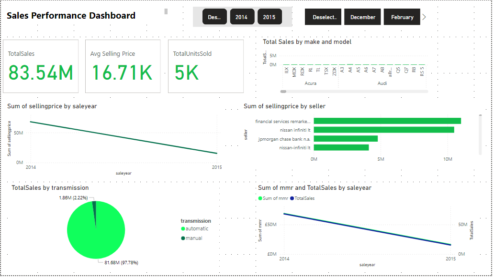
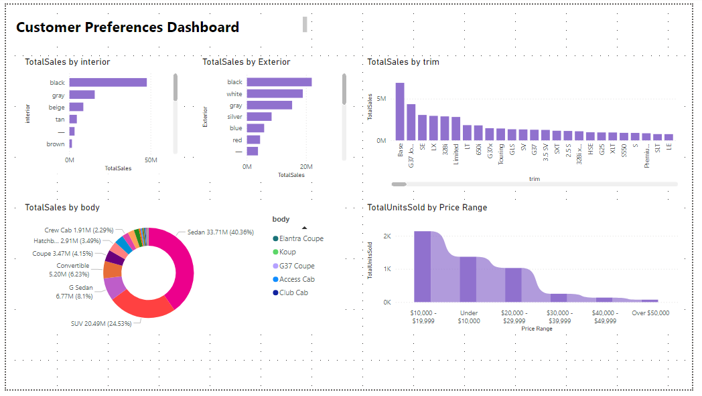
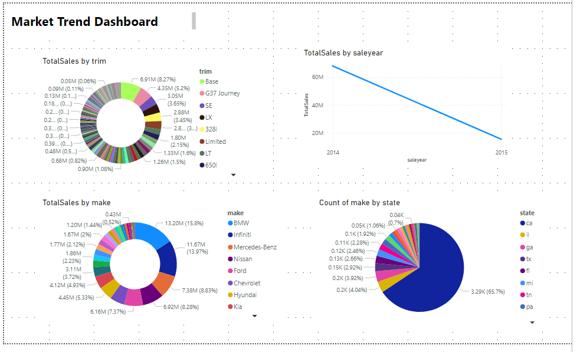
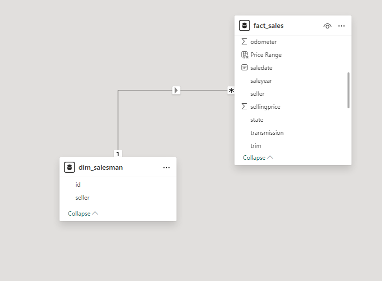

# Car Sales Dashboards Project

## Overview

This project involves creating a series of interactive dashboards using Microsoft Power BI, focused on car sales data. The dashboards provide key insights into sales performance, customer preferences, inventory management, and profitability, aiding decision-makers and stakeholders in making informed business decisions.

## Objective

To deliver a set of dashboards that help visualize and analyze car sales data, enabling users to track performance metrics, understand customer preferences, and forecast future trends.

## Dataset Description

The dataset used for this project includes the following columns:
- **Year**: Year of the car sale.
- **Company**: Car manufacturer.
- **Model**: Specific car model.
- **Trim**: Trim level of the car.
- **Body**: Body type (e.g., SUV, sedan).
- **Transmission**: Type of transmission (automatic, manual).
- **Color**: Exterior color of the car.
- **Selling Price**: Sale price of the car.
- **Sales Date**: Date of the sale.
- **Interior Color**: Interior color of the car.
- **Sales Person**: Salesperson handling the sale.
- **Odometer Data**: Odometer reading at the time of sale.

## Dashboards

### 1. Sales Performance Dashboard
   - **KPI Cards**: Total sales, average selling price, total units sold.
   - **Time Series Chart**: Sales trends over time.
   - **Sales by Company**: Bar chart for sales by car manufacturer.
   - **Sales by Model**: Bar chart for the popularity of different car models.
   - **Sales by Transmission**: Pie or donut chart comparing sales across transmission types.

### 2. Salesperson Performance Dashboard
   - **Top Performers**: Highlights top salespeople based on total sales.
   - **Sales by Region/Location** (Optional): Map or bar chart for salesperson performance by region.
   - **Sales by Month**: Line chart showing sales performance over time.

### 3. Customer Preferences Dashboard
   - **Color Preferences**: Bar chart displaying sales by exterior and interior car colors.
   - **Body Type Analysis**: Donut chart visualizing sales by car body type (e.g., SUV, sedan).
   - **Trim Level Analysis**: Comparison of sales across different trim levels.
   - **Sales by Price Range**: Histogram or bar chart segmenting sales into different price ranges.

### 4. Market Trend Dashboard
   - **Year-over-Year Sales Growth**: Line chart comparing sales performance year over year.
   - **Sales Forecasting**: Time series forecasting to predict future sales based on historical data.

## Technical Implementation

### Tools Used
- **Microsoft Power BI Desktop**: For creating and designing dashboards.
- **Power Query Editor**: For data cleaning and transformation.
- **DAX (Data Analysis Expressions)**: For creating calculated columns and measures.
- **Power BI Service**: For publishing and sharing the dashboards.

### Data Preparation
- **Data Cleaning**: Cleaned the data using Power Query Editor, handling missing values and ensuring correct data types.
- **Calculated Columns and Measures**: Created additional columns and measures using DAX for detailed analysis.
- **Data Modeling**: Established relationships between tables (if multiple tables were used).

### Dashboard Development Process
1. **Importing Data**: Loaded the CSV dataset into Power BI.
2. **Creating Visualizations**: Developed visualizations using various chart types (e.g., bar charts, line charts, KPIs).
3. **Adding Interactivity**: Implemented slicers, filters, and drill-throughs for enhanced interactivity.
4. **Formatting and Layout**: Customized the dashboards for visual appeal and ease of interpretation.
5. **Testing**: Tested dashboards with different data scenarios to ensure accuracy and functionality.
6. **Publishing**: Published the dashboards to Power BI Service for sharing and review.

## Challenges and Solutions
- **Data Quality Issues**: Addressed missing and inconsistent data through thorough data cleaning.
- **Complex Relationships**: Simplified complex relationships by creating appropriate data models and measures.
- **Performance Optimization**: Optimized performance using Power BI techniques like reducing visual load and optimizing DAX queries.

## Example Dashboards

